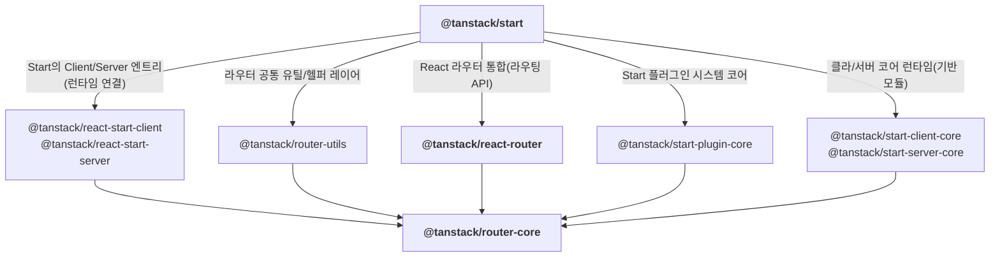

최근에 회사에서 공유했던 TanStack Start에 대한 내용을 가지고 블로그에도 글을 써보고자 한다.

클라이언트 사이드 렌더링을 주로 활용했었던 과거와 달리, 많은 회사에서 풀 스택 프레임워크를 도입하여 페이지 렌더링을 다양한 방식으로 처리하여 서비스들을 운영하고 있다.

내가 경험했던 회사와 서비스들 그리고 현재에도 운영하고 있는 서비스들은 Next.js를 주로 활용하고 있지만, TanStack에서 새롭게 발표한 TanStack Start라는 풀 스택 프레임워크가 흥미로워서 간단히 살펴보았다.

## TanStack Start?

TanStack Start는 TanStack Router를 만든 Tanner Linsley가 주도하는 새로운 풀스택 프레임워크이다.

<div className='my-4 block justify-start gap-4 sm:flex'>
  
  <div>
    <blockquote className='text-lg font-bold mb-6 flex flex-col gap-4 italic'>
      <p>TanStack Start는</p>
      <p>95%의 TanStack Router와</p>
      <p>5%의 서버사이드 작업을 위한 작은 레이어로 이루어져있다.</p>
    </blockquote>
    <p>
      Tanner Linsley는 TanStack Start에 대해{' '}
      <a className='custom-anchor youtube' href='https://www.youtube.com/watch?v=4PymccvinIo&t=179s'>
        Next Gen Fullstack React with TanStack
      </a>{' '}
      유투브 영상에서 위와 같이 간략하게 소개하였다.
    </p>
  </div>
</div>

5%의 서버사이드 레이어는 **Vite**, **Nitro** 두 가지로 구성되었다고 소개를 하였다. 영상에서는 Vinxi라는 프레임워크도 같이 언급하였지만, Vinxi는 RC 버전에서 제거되었다.

- **Vite** - 기본 개발 환경 구성 및 빌드, 개발 서버 제공 프레임워크
- **Nitro** - 서버리스 우선(Serverless-first)적인 웹 애플리케이션 프레임워크 ( Nuxt3의 핵심 엔진 )

따라서, TanStack Start를 사용한다면 TanStack Router에서 제공하는 기능 외에 추가적으로 아래와 같은 기능들을 이용할 수 있다.

- **전체 문서 SSR 및 하이드레이션**
- **스트리밍 SSR**
- **서버 함수 / RPC**
- **지원되는 다양한 런타임 ( Node, Bun, Deno, Edge )**

공식 문서에서도 Tanstack Router로 해결할 수 있는 부분 외에 위에 나열된 기능들이 필요한 경우 사용을 권장하고 있다.

React Server Components(이하 RSC) 같은 경우는 현재 지원하지 않고 있으며, 곧 지원할 예정이라고 밝힌 상태이다.

## TanStack Router?

TanStack Start를 사용하려면 먼저 TanStack Router에 대해 알아두면 매우 쉽게 접근할 수 있는데, 일반적으론 CSR 프레임워크로 분류되어 아래와 같은 기능들을 이용할 수 있다.

- **모든 라우팅 관련 요소(경로, 파라미터, 검색 매개변수 등)들에 대해 완벽한 타입스크립트 지원을 통해 타입 안전성 제공**

- **파일 기반 라우팅 시스템과 중첩, 레이아웃 구조를 통한 유연한 라우팅 설계**

- **내장된 데이터 로더 & 캐싱**

- **라우트 매칭/로깅 미들웨어 제공**

React Router를 사용해 본 경험이 있다면 어렵지 않게 사용할 수 있는 기능들이고, 훌륭한 타입스크립트 지원 덕분에 좋은 DX까지 느낄 수 있기도 하다.

조금 더 자세히 알아보면 재미나게도 **TanStack Router도 실험적 기능을 사용하여 SSR을 할 수 있다는 점**이다.

### TanStack Router의 SSR

기능적으로는 전체 문서 SSR 및 하이드레이션, Streaming SSR이 지원되는데 CSR으로만 설정한 TanStack Router과는 다르게 아래와 같이 **서버, 클라이언트 엔트리 모듈이 필요하다.**

```tsx title="src/entry-server.tsx"
import { createRequestHandler, defaultStreamHandler } from '@tanstack/react-router/ssr/server';
import { createRouter } from './router';

export async function render({ request }: { request: Request }) {
  const handler = createRequestHandler({ request, createRouter });

  return await handler(defaultStreamHandler);
}
```

```tsx title="src/entry-client.tsx"
import { hydrateRoot } from 'react-dom/client';
import { RouterClient } from '@tanstack/react-router/ssr/client';
import { createRouter } from './router';

const router = createRouter();

hydrateRoot(document, <RouterClient router={router} />);
```

위와 같이 엔트리들을 구성한 후, 서버 런타임에서 아래와 같이 서버 모듈을 실행하여 SSR을 처리할 수 있다.

```json title="package.json"
  ...
  "scripts": {
    "serve": "NODE_ENV=production node server.js",
  }

// server.js 내부에는 server, client 엔트리를 불러와서 SSR을 처리하는 코드가 들어간다.
```

더 자세한 예제는 [공식 문서의 예제](https://tanstack.com/router/latest/docs/framework/react/examples/basic-ssr-streaming-file-based)에서 확인할 수 있다.

## TanStack Start와 Tanstack Router의 관계

**내부적으로 @tanstack/router-core 모듈을 통해 SSR이 지원**되며, 이는 **TanStack Start에서도 동일하게 구성**되어 있는 상황이다.

TanStack Router의 SSR 관련 주요 기능들, 그리고 TanStack Start과 얽혀있는 내용들을 정리하면 아래과 같이 볼 수 있다.

| 시점          | 내용                                                                                                                                                                                                                                                           |
| ------------- | -------------------------------------------------------------------------------------------------------------------------------------------------------------------------------------------------------------------------------------------------------------- |
| 2023년        | @tanstack/router 초기 개발 시작.<br/>핵심 경로 매칭, history 관리, loader 구조 설계에 집중. SSR은 아직 없음.                                                                                                                                                   |
| 2024년 상반기 | **@tanstack/router-core v1.0 베타 단계에서 createServerRouter, dehydrate, hydrate API가 실험적으로 도입됨**<br/>서버에서 라우터를 실행하고 loader를 프리패치하는 SSR 유틸리티가 추가됨.                                                                        |
| 2024년 하반기 | **@tanstack/start 알파 공개.**<br/>@tanstack/router-core SSR 유틸리티를 실제 Vite + React 환경에서 DX 좋게 래핑한 파일 기반 풀스택 프레임워크로 등장.                                                                                                          |
| 2025년 7월    | @tanstack/router-core 의 SSR 기능은 여전히 experimental로 관리 중.<br/>**@tanstack/start는** router-core SSR을 기본으로 사용하여 createServerRouter + Vite SSR + React Query hydration을 자동으로 처리.<br/>다양한 실제 사용 피드백을 받아 **안정화 진행 중.** |
| 2025년 9월    | **@tanstack/start RC 릴리즈.**                                                                                                                                                                                                                                 |

추측컨데 TanStack Router를 제공할 당시부터 SSR 기능을 염두에 두고 설계가 진행되지 않았을까 생각된다.

TanStack Start가 RC 버전으로 릴리즈된 지금도 여전히 @tanstack/router-core에 대한 의존성을 가지고 있는 상황이다.



## TanStack Start의 주요 기능들

TanStack Start의 주요 기능들을 하나씩 살펴보자.

- **전체 문서 SSR 및 하이드레이션**
- **스트리밍 SSR**
- **서버 함수 / RPC**
- **지원되는 다양한 런타임 ( Node, Bun, Deno, Edge )**

### 전체 문서 SSR 및 하이드레이션

TanStack Start는 **기본적으로 모든 라우트에 대해 SSR이 활성화**되어 있다.
이는 루트 라우트에서 전역으로 설정을 할 수 있고, 하위 라우트 개별적으로 설정이 가능하다.

SSR 동작은 서버로 요청이 들어오면 서버가 해당 라우트의 `beforeLoad`, `loader`를 실행하고, 컴포넌트를 HTML로 렌더링한 뒤 내려준다.
그리고 브라우저에서는 `<Scripts />`를 통해 로드된 번들이 hydration을 수행하면서 "이미 그려진 HTML"을 "동작하는 React 앱"으로 바꾼다. ( 공식 문서에서는 이 기본 동작을 ssr: true로 설명)

**TanStack Start가 전체 문서(full-document) SSR이라고 말하는 이유는, 루트 라우트에서 `<html>`, `<head>`, `<body>`까지 포함한 문서 골격을 직접 구성하도록 가이드하기 때문이다.**
예를 들어 Start 기본 예제에서는 루트 라우트에서 shellComponent를 정의하고, 그 안에 `<HeadContent />`와 `<Scripts />`를 배치한다.

```tsx title="src/routes/__root.tsx"
import { HeadContent, Scripts, Outlet, createRootRoute } from '@tanstack/react-router';

export const Route = createRootRoute({
  shellComponent: RootDocument,
});

function RootDocument({ children }: { children: React.ReactNode }) {
  return (
    <html>
      <head>
        <HeadContent />
      </head>
      <body>
        {children}
        <Scripts />
      </body>
    </html>
  );
}
```

```tsx title="src/routes/demo/start/ssr/full-ssr.tsx ( 하위 라우트의 전체 문서 SSR 예제 )" {4-6}
import { createFileRoute } from '@tanstack/react-router';
import { createServerFn } from '@tanstack/react-start';

export const getPunkSongs = createServerFn({
  method: 'GET',
}).handler(async () => [
  { id: 1, name: 'Teenage Dirtbag', artist: 'Wheatus' },
  { id: 2, name: 'Smells Like Teen Spirit', artist: 'Nirvana' },
  { id: 3, name: 'The Middle', artist: 'Jimmy Eat World' },
  { id: 4, name: 'My Own Worst Enemy', artist: 'Lit' },
  { id: 5, name: 'Fat Lip', artist: 'Sum 41' },
  { id: 6, name: 'All the Small Things', artist: 'blink-182' },
  { id: 7, name: 'Beverly Hills', artist: 'Weezer' },
]);

export const Route = createFileRoute('/demo/start/ssr/full-ssr')({
  component: RouteComponent,
  loader: async () => await getPunkSongs(), // 서버에서 데이터 페칭
});
// loader는 "초기 요청 때는 서버에서", "이후 클라이언트 내비게이션에서는 브라우저에서"도 실행될 수 있다.
// 그래서 process.env 같은 값을 loader 안에서 바로 읽으면, 클라이언트 번들에 섞이거나(혹은 런타임에서 터지거나) 문제가 된다.
// 이런 경우에는 서버 함수(createServerFn)나 서버 전용 유틸(createServerOnlyFn)로 경계를 명확히 나누는 게 핵심이다.

function RouteComponent() {
  const punkSongs = Route.useLoaderData();

  return (
    <div
      className='flex items-center justify-center min-h-screen bg-gradient-to-br from-zinc-800 to-black p-4 text-white'
      style={{
        backgroundImage: 'radial-gradient(50% 50% at 20% 60%, #1a1a1a 0%, #0a0a0a 50%, #000000 100%)',
      }}>
      <div className='w-full max-w-2xl p-8 rounded-xl backdrop-blur-md bg-black/50 shadow-xl border-8 border-black/10'>
        <h1 className='text-3xl font-bold mb-6 text-purple-400'>Full SSR - Punk Songs</h1>
        <ul className='space-y-3'>
          {punkSongs.map((song) => (
            <li key={song.id} className='bg-white/10 border border-white/20 rounded-lg p-4 backdrop-blur-sm shadow-md'>
              <span className='text-lg text-white font-medium'>{song.name}</span>
              <span className='text-white/60'> - {song.artist}</span>
            </li>
          ))}
        </ul>
      </div>
    </div>
  );
}
```

**앞서 언급한대로 라우트 단위로 SSR 동작을 조절할 수도 있다.** ( **Selective SSR** )

기본은 `ssr: true`지만, 라우트에 `ssr: false`(완전 CSR) 또는 `ssr: 'data-only'`(데이터는 서버에서 준비, UI는 클라이언트에서 렌더)처럼 모드를 줄 수 있다.

### 스트리밍 SSR

스트리밍 SSR(Streaming Server-Side Rendering)은 **"모든 데이터가 준비된 뒤에 한 번에 HTML을 내려주는 방식"** 대신, **먼저 그릴 수 있는 UI를 즉시 내려주고** **나머지 UI는 준비되는 순서대로 채워 넣는** 렌더링 전략이다.

특히 아래와 같은 화면에서 효과가 크다.

- **레이아웃/상단 핵심 콘텐츠/내비게이션**처럼 초기 가시성이 중요한 영역은 빠르게 노출하는 경우
- **댓글/추천/통계·집계/외부 연동 데이터**처럼 지연될 수 있는 데이터는 준비되는 즉시 해당 영역만 이어서 렌더링하는 경우

이 방식은 사용자 입장에서는 **빈 화면 대기 시간**을 줄여주고, 개발자 입장에서는 **UI를 Suspense boundary 단위로 의도적으로 쪼개서,** 느린 영역만 독립적으로 처리할 수 있게 해준다.

loader에서는 **즉시 필요한 데이터는 `await` 해서 먼저 확정**하고, 오래 걸려도 되는 데이터는 **Promise를 그대로 반환하는 deferred 패턴**으로 미뤄둘 수 있다.

TanStack Start는 이걸 **[TanStack Router의 Deferred Data Loading](https://tanstack.com/router/v1/docs/framework/react/guide/deferred-data-loading) + `<Await />`** 조합으로 손쉽게 구현할 수 있다.
그리고 이 패턴은 **서버에서만**이 아니라, 이후 **클라이언트 내비게이션에서도 동일하게 동작**한다는 게 포인트다.

```tsx title="src/routes/home.tsx"
import { Await, createFileRoute } from '@tanstack/react-router';
import { createServerFn } from '@tanstack/react-start';
import * as React from 'react';

// 빠른 데이터
const getHero = createServerFn().handler(async () => {
  return { title: 'Hello Start', subtitle: 'TTFB는 빠르게, 완성도는 점진적으로' };
});

// 느린 데이터 (데모용)
const getFeed = createServerFn().handler(async () => {
  await new Promise((r) => setTimeout(r, 1_500));
  return Array.from({ length: 5 }).map((_, i) => ({
    id: i + 1,
    text: `feed item #${i + 1}`,
  }));
});

export const Route = createFileRoute('/home')({
  ssr: true, // 기본값이긴 한데 명시해도 OK
  loader: async () => {
    return {
      hero: await getHero(),
      feed: getFeed(), // await 하지 않음 (deferred)
    };
  },
  component: HomePage,
});

function HomePage() {
  const data = Route.useLoaderData();

  return (
    <main style={{ padding: 24 }}>
      <h1>{data.hero.title}</h1>
      <p>{data.hero.subtitle}</p>

      <section style={{ marginTop: 24 }}>
        <h2>Feed</h2>

        <Await
          promise={data.feed}
          fallback={<div style={{ opacity: 0.6 }}>피드 불러오는 중...</div>}
          children={(items) => (
            <ul>
              {items.map((it) => (
                <li key={it.id}>{it.text}</li>
              ))}
            </ul>
          )}
        />
      </section>
    </main>
  );
}
```

내부적으로 **TanStack Start의 스트리밍 SSR은 Web Streams 기반 렌더링을 우선**한다.

`react-dom/server`에서 `renderToReadableStream`을 쓸 수 있는 환경이면 이 메서드를 호출하고, 환경이 안 맞으면 Node용 `renderToPipeableStream`으로 폴백하는 식이다.
덕분에 **Node뿐 아니라 Bun/Deno/Edge 같은 런타임에서도 "스트림으로 응답을 흘려보내는" 큰 구조는 동일**하게 가져갈 수 있다. ( [내부 구현 코드](https://github.com/TanStack/router/blob/main/packages/react-router/src/ssr/renderRouterToStream.tsx) )

결론적으로 Next.js의 스트리밍 SSR과 같은 결이다. 먼저 **shell에서 TTFB/초기 가시성을 확보**하고, 느린 섹션은 데이터가 준비되는 대로 **스트림에서 순차적으로 합류**하면서 화면이 점점 완성된다.

이 구현을 손쉽게 처리해 주는 **`Deferred Data Loading`** + **`<Await />`** API를 통해, React 18이 제공하는 스트리밍 SSR + Suspense를 잘 녹여 낸것으로 보인다.

개인적으론 TanStack만의 좋은 DX가 이 지점에서 나온다고 느꼈다.
스트리밍 SSR 자체는 React 18이 제공하는 기본 기능이고 Next.js도 같은 결로 풀어가지만, TanStack은 그걸 라우터, 로더 레이어에서 하나의 "패턴"으로 정리해둔 느낌이다.

### Selective SSR

기본적으로 TanStack Start는 **모든 라우트가 SSR 활성화**로 설정되어 있다.

다만 라우트 단위로 `ssr` 옵션을 줄 수 있어서, 화면 성격에 맞게 렌더링 전략을 바꿀 수 있다.

| 옵션               | 컴포넌트(서버) | 컴포넌트(클라) | loader(서버) | loader(클라) | beforeLoad(서버) | beforeLoad(클라) |
| ------------------ | -------------- | -------------- | ------------ | ------------ | ---------------- | ---------------- |
| `ssr: true` (기본) | ✅             | ✅             | ✅           | ✅           | ✅               | ✅               |
| `ssr: "data-only"` | ❌             | ✅             | ✅           | ✅           | ✅               | ✅               |
| `ssr: false`       | ❌             | ✅             | ❌           | ✅           | ❌               | ✅               |

- **`true` (기본)** : SSR. 스트리밍이 걸리면 shell이 먼저 나오고 나머지가 합류한다.
- **`"data-only"`** : 데이터만 서버에서 미리 가져오고 렌더링은 클라이언트에서만 진행한다.
- **`false`** : 완전 CSR. HTML은 비어 있고 클라이언트에서 전부 시작한다.

지도/3D/캔버스처럼 브라우저에서만 렌더링되는 화면을 구성한다면 SSR의 이점이 제한적이므로 손쉽게 비활성화 처리를 할 수 있고, SEO/TTFB가 중요한 화면은 SSR로 제공하여 라우트별로 다양한 전략을 손쉽게 구현할 수 있다는 것이 매력적이다.

### 서버 함수(Server Functions)

TanStack Start의 서버 함수는 **"클라이언트에서 서버 로직을 함수처럼 호출"할 수 있게 만드는 RPC 레이어**다.

**사용 경험(호출 방식)은 함수 호출처럼 유지**하면서, **실제로는 네트워크 경계를 안전하게 넘는 호출로 컴파일**되는 형태이다.

**애플리케이션 어디에서든 서버 로직을 함수 형태로 호출**할 수 있고, 클라이언트에서 서버 함수를 호출하는 경우에는 호출이 서버로의 fetch 요청으로 바뀐다.
따라서, **클라이언트 컴포넌트를 다루는 코드에서 서버 함수를 import해도 안전**하고, 빌드 과정 중 클라이언트 번들에서 서버 로직이 RPC stub으로 교체되기 때문에 실제 서버 코드는 브라우저로 전달되지 않는다.

#### 기본 예시

서버 함수는 보통 아래 체인으로 구성한다.

`createServerFn({ method })` : 이 함수가 어떤 HTTP 메서드 성격인지(조회/변경)를 명시<br />
&nbsp;&nbsp; `.inputValidator(...)`: 네트워크 경계를 넘는 입력을 검증/정규화<br/>
&nbsp;&nbsp;`.handler(...)` : 서버에서만 실행될 실제 로직

이 구조 덕분에 **입력 타입 → 검증 → 실행 로직**이 한 곳에 모이고, 호출자는 동일한 인터페이스로만 사용하게 된다.

```tsx
import { createServerFn } from '@tanstack/react-start';
import { z } from 'zod';

const UserSchema = z.object({
  name: z.string().min(1),
  age: z.number().min(0),
});

export const getUser = createServerFn({ method: 'GET' })
  .inputValidator(UserSchema)
  .handler(async ({ data }) => {
    return findUserById(data.id);
  });
```

또한, 서버 함수는 **단일 data 파라미터를 받으며**, 네트워크 경계이기 때문에** validation이 타입 안정성과 런타임 정확성을 보장**하며

라우터의 **`loader` 같은 서버 수명주기뿐 아니라, 컴포넌트에서도 `useServerFn()` 형태로 호출**할 수 있다.

```tsx
// In a route loader
export const Route = createFileRoute('/posts')({
  loader: () => getServerPosts(),
});

// In a component
function PostList() {
  const getPosts = useServerFn(getServerPosts);

  const { data } = useQuery({
    queryKey: ['posts'],
    queryFn: () => getPosts(),
  });
}
```

#### 에러 처리

서버 함수는 성공 값뿐 아니라 에러/리다이렉트/notFound 같은 제어 흐름도 지원한다.<br/>
그리고 이런 결과는 `useServerFn()`이나 라우트 수명주기에서 "자연스럽게" 처리되도록 설계되어 있다.

```tsx title="일반 에러는 클라이언트로 serialize되어 전달"
import { createServerFn } from '@tanstack/react-start';

export const riskyFunction = createServerFn().handler(async () => {
  if (Math.random() > 0.5) {
    throw new Error('Something went wrong!');
  }
  return { success: true };
});

// Errors are serialized to the client
try {
  await riskyFunction();
} catch (error) {
  console.log(error.message); // "Something went wrong!"
}
```

```tsx title="인증 필요 시 redirect()를 throw"
import { createServerFn } from '@tanstack/react-start';
import { redirect } from '@tanstack/react-router';

export const requireAuth = createServerFn().handler(async () => {
  const user = await getCurrentUser();

  if (!user) {
    throw redirect({ to: '/login' });
  }

  return user;
});
```

```tsx title="리소스가 없으면 notFound()를 throw"
import { createServerFn } from '@tanstack/react-start';
import { notFound } from '@tanstack/react-router';

export const getPost = createServerFn()
  .inputValidator((data: { id: string }) => data)
  .handler(async ({ data }) => {
    const post = await db.findPost(data.id);

    if (!post) {
      throw notFound();
    }

    return post;
  });
```

이러한 구조는 "API 응답을 status code로 분기하고, 프론트에서 다시 해석하는" 패턴보다 라우팅/렌더링 수명주기와 더 직접적으로 결합된다.

#### 다양한 기능과 형태로 사용

서버 함수는 "그냥 RPC"를 넘어서, 요청/응답 컨텍스트를 다룰 수도 있다.<br/>
아래 예시처럼 `getRequest()`, `getRequestHeader()`로 요청을 읽고, `setResponseHeaders()`, `setResponseStatus()`로 응답을 조정할 수 있다.

```tsx
import { createServerFn } from '@tanstack/react-start';
import { getRequest, getRequestHeader } from '@tanstack/react-start/server';
import { setResponseHeaders, setResponseStatus } from '@tanstack/react-start/server';

export const getCachedData = createServerFn({ method: 'GET' }).handler(async () => {
  // Access the incoming request
  const request = getRequest();
  const authHeader = getRequestHeader('Authorization');

  // Set response headers (e.g., for caching)
  setResponseHeaders(
    new Headers({
      'Cache-Control': 'public, max-age=300',
      'CDN-Cache-Control': 'max-age=3600, stale-while-revalidate=600',
    }),
  );

  // Optionally set status code
  setResponseStatus(200);

  return fetchData();
});
```

또, **서버 함수 미들웨어**와 함께 사용한다면 입력 데이터를 검증하거나 서버 함수 실행 전후에 클라이언트 측 로직을 수행하는 등의 처리를 할 수 있다.

- 인증/인가: "서버 함수 실행 전에" 강제하기
- 로깅/트레이싱: "RPC 호출 단위로" 일관된 관측성 부여하기
- 공통 컨텍스트 주입: request 단위 데이터(예: workspaceId) 전파하기

```tsx
import { createMiddleware, createServerFn } from '@tanstack/react-start';

const loggingMiddleware = createMiddleware({ type: 'function' })
  .client(() => {
    // 서버 함수 호출 전후에 클라이언트 측에서 실행할 로직
  })
  .server(() => {
    // 서버 함수가 실행되기 전, 실행된 후에 서버에서 실행할 서버 측 로직
  });

const fn = createServerFn()
  .middleware([loggingMiddleware])
  .handler(async () => {
    //...
  });
```

이외에도 **비동기 제너레이터와 함께 스트리밍 데이터**를 전달할 수 있고, **빌드 타임에 정적으로 서버 함수를 구성하여 결과를 캐싱**할 수도 있으며, 서버 함수의 `.url` 속성을 활용해 JS없이 HTML form으로도 호출할 수 있다고 한다.

서버 함수는 TanStack Start의 핵심 기능 중 하나로, 타입 안전성, 실행 경계(클라이언트/서버) 분리, 그리고 호출 일관성을 하나의 추상화로 묶는다. 이러한 접근은 별도의 API 레이어 없이 서버 로직을 구성할 수 있게 하며, 클라이언트와 서버 사이의 경계를 보다 명확하고 일관된 방식으로 다룰 수 있게 만든다.

## 마치며

TanStack Start를 살펴보면서 느낀 점은, 이 프레임워크가 단순히 새로운 기능을 추가한 것이 아니라 **기존 풀스택 개발 방식 자체를 다른 시선으로 바라보게 만든다**는 점이었다.

특히 **라우터 중심 구조 위에 SSR, 스트리밍, 서버 함수가 자연스럽게 얹히는 방식**은 기존에 API 레이어를 별도로 설계하던 흐름과는 다른 방향성을 보여준다.

TanStack Router를 사용해 본 경험이 있다면 **비교적 빠르게 적응할 수 있을 것 같다는 인상**도 받았고, 개인적으로는 Next.js를 사용해 온 경험과 비교했을 때 **데이터 흐름과 서버 로직이 더 일관되고 단순**하게 느껴지는 지점도 있었다.

물론 아직은 RC 단계인 만큼 실제 서비스 적용에는 고려할 요소들이 남아있지만, 이러한 접근이 **앞으로 어떤 형태로 자리 잡을지는 충분히 지켜볼 만한 가치가 있어 보인다.**

---

## 참고

- [TanStack Start 문서](https://tanstack.com/start/latest)
- [TanStack Start가 Nitro를 사용한 이유](https://tanstack.com/blog/why-tanstack-start-is-ditching-adapters#tanstack-start--nitro--vite--tanstack-router)
- [TanStack Router 소스 및 SSR](https://github.com/TanStack/router)
- [React DOM Server — renderToReadableStream / renderToPipeableStream](https://react.dev/reference/react-dom/server/renderToReadableStream)
- [Sentry × TanStack Start 가이드](https://docs.sentry.io/platforms/javascript/guides/tanstackstart-react/)
- [Tanner Linsley 인터뷰 — Next Gen Fullstack React with TanStack (YouTube)](https://www.youtube.com/watch?v=XXXXX)
