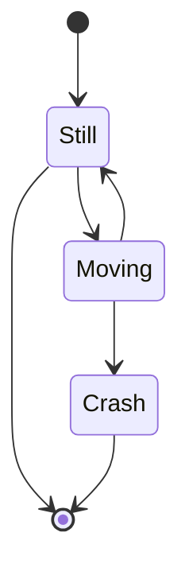

이 글에서는 현재 운영 중인 서비스에서 도입한 **`ts-pattern`** 이라는 라이브러리를 통해 여러 문제들을 해결했던 내용들에 대해 작성해 볼 예정이다.

자바스크립트도 [제안 단계](https://github.com/tc39/proposal-pattern-matching)이기 때문에 알고 있는 사람들도 있겠지만, 일반적인 경우에 자바스크립트로만 개발을 해왔던 개발자라면 패턴 매칭이라는 개념 자체도 생소할 수 있다. 필자도 마찬가지였다.

따라서, 글의 주제인 **`ts-pattern`** 을 활용하여 해결했던 것을 이야기하기 전에, 패턴 매칭이라는 것부터 친숙해질 수 있는 시간을 가져보자.

## 패턴 매칭?

**패턴 매칭(pattern matching)**은 **데이터를 검색할 때 특정 패턴이 출현하는지, 또한 어디에 출현하는지 등을 특정하는 방법의 일종**이다.

패턴 매칭은 검색, 분석, 정규화, 추출 등 다양한 응용 분야에서 사용하고 있으며, 자바스크립트에서도 정규표현식을 활용하여 문자열에서 특정 패턴을 찾아 검색, 추출, 대체 등을 수행할 때 사용되는 개념이다.

현재 많은 함수형 언어(Rust, Swift, Elixir, Haskell, Erlang, F#, Scala 등)에서 직접적인 패턴 매칭이 지원되며, Python도 3.10 버전에서 [구조적 패턴 매칭(Structural Pattern Matching)](https://peps.python.org/pep-0634/)이라는 이름으로 도입되었다.

직접 패턴 매칭 기능을 활용하면 데이터의 값, 자료구조, 타입 등 여러가지 유형의 패턴으로 검색을 수행할 수 있고, 특정 데이터 구조에서 원하는 값을 추출할 수도 있다. 이는 적은 양의 코드로 많은 양의 데이터를 읽고 다루기에 아주 좋은 표현 방법이며, 이로 인해 코드의 가독성과 유지보수성도 향상시킬 수 있다.

### 자바스크립트에서의 사용

아직까지 자바스크립트에서는 사용할 수 없다.

앞서 말한 듯이 ECMA 표준이 되기 위한 **[제안 단계(TC39 process, Stage 1)](https://tc39.es/proposal-pattern-matching/)일 뿐이다.** 아래와 같은 문제들을 가지고 제안이 시작되었으니 간단히 맥락 정도만 짚고 넘어가 보자.

- 자바스크립트에 **값을 일치시키는 방법은 많지만**, 문자열을 위한 **정규표현식 외에 패턴을 일치시키는 방법은 없다.**
- `switch`에는 많은 제약이 있다.
  - 유일한 비교는 일치 연산자(`===`)만이 사용 가능
  - 우발적인 실패를 방지하기 위해선 각 `case`별로 `break` 문이 필요
  - `case` 의 애매한 scope ( 중괄호로 감싸지 않는다면 블록 범위 변수는 다른 `case` 에서도 접근 가능 )
  - 기타 등등

오래전 자바스크립트 생태계와 달리 다룰 수 있는 것들 것들이 넓고 더 깊어지면서 크고 다양한 값들을 처리하기 위한 방법이 필요해진 것으로 맥락을 해석할 수도 있을 것 같다.

매년 연말에 실시하는 **[State of JavaScript](https://stateofjs.com/en-US)**에서도 패턴 매칭 기능에 대한 니즈를 보여주고 있다.


자바스크립트 생태계는 아니지만 [파이썬의 패턴 매칭 도입에 얽힌 이야기](https://ryanking13.github.io/2021/03/04/python-patma.html)도 같이 읽어보면 재미있을 것 같다.

**결국 현시점에서 자바스크립트에서 사용은 별도 라이브러리의 도움을 받을 수 밖에 없는 상황이고,**

이를 도와주는 **`ts-pattern`** 과 몇 가지 사례를 소개하겠다.

## ts-pattern

**`ts-pattern`**은 이름에서 볼 수 있듯이 패턴 매칭을 타입스크립트로 쉽게 표현할 수 있게 해주는 라이브러리다.

더 안전하고 나은 조건을 작성할 수 있고, 이를 간결하게 표현할 수 있으며 그에 따라 코드 가독성도 좋아지고 철저한 검사를 통해 케이스 누락을 방지할 수 있다.

지난 2년간의 npm trends만 보더라도 라이브러리의 엄청난 추세를 확인할 수 있다.


### 주요 기능

다음은 [`ts-pattern` 문서](https://github.com/gvergnaud/ts-pattern?tab=readme-ov-file#features)에 나열된 기능이다.

- 중첩된 객체, 배열, 튜플, 세트, 맵 및 모든 기본 유형 등 모든 데이터 구조에 대한 패턴 일치
- 유용한 유형 추론을 통해 유형이 안전
- 완전성 검사 지원을 통해 가능한 모든 사례를 `.exhaustive()`와 일치하도록 강제
- 패턴을 사용하여 `isMatching`으로 데이터의 형태를 검증 가능
- 포괄 및 유형별 와일드카드(`P._`, `P.string`, `P.number` 등)가 포함된 표현형 API
- 중요하지 않은 경우에 대한 술어(, 결합, 교차 및 제외 패턴을 지원
- P.select(name?) 함수를 통해 속성 선택을 지원합니다.
- 작은 번들 공간(~2kB에 불과)

```js title="hello.js"
asdf;
```

```js title="hello.js"
<div>haha</div>
<div>haha</div>
```



### 실제 예제

## 마치며

## 참고

- https://tc39.es/process-document/
- https://github.com/gvergnaud/ts-pattern?tab=readme-ov-file
- [위키피디아](https://ko.wikipedia.org/wiki/%ED%8C%A8%ED%84%B4_%EB%A7%A4%EC%B9%AD)
