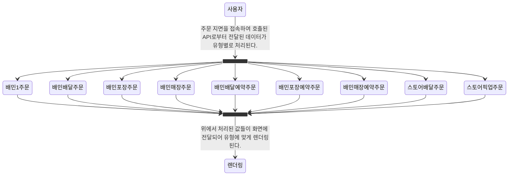

현재 운영 중인 서비스에서 도입한 **`ts-pattern`** 이라는 라이브러리를 통해 여러 문제들을 해결했던 내용들에 대해 작성해 볼 예정이다.

패턴 매칭은 자바스크립트도 [제안 단계](https://github.com/tc39/proposal-pattern-matching)이기 때문에 알고 있는 사람들도 있겠지만, 일반적인 경우에 자바스크립트로만 개발을 해왔던 개발자라면 패턴 매칭이라는 개념 자체도 생소할 수 있다.

따라서, 글의 주제인 **`ts-pattern`** 을 활용하여 해결했던 것을 이야기하기 전에, 패턴 매칭이라는 것부터 친숙해질 수 있는 시간을 가져보자.

## 패턴 매칭?

**패턴 매칭(pattern matching)**은 **데이터를 검색할 때 특정 패턴이 출현하는지, 또한 어디에 출현하는지 등을 특정하는 방법의 일종**이다.

패턴 매칭은 검색, 분석, 정규화, 추출 등 다양한 응용 분야에서 사용하고 있으며, 자바스크립트에서도 정규표현식을 활용하여 문자열에서 특정 패턴을 찾아 검색, 추출, 대체 등을 수행할 때 사용되는 개념이다.

현재 많은 함수형 언어(Rust, Swift, Elixir, Haskell, Erlang, F#, Scala 등)에서 직접적인 패턴 매칭이 지원되며, Python도 3.10 버전에서 [구조적 패턴 매칭(Structural Pattern Matching)](https://peps.python.org/pep-0634/)이라는 이름으로 도입되었다.

직접 패턴 매칭 기능을 활용하면 데이터의 **값, 자료구조, 타입 등 여러가지 유형의 패턴으로 검색**을 수행할 수 있고, 특정 데이터 구조에서 **원하는 값을 추출**할 수도 있다. 이는 적은 양의 코드로 많은 양의 데이터를 읽고 다루기에 아주 좋은 표현 방법이며, 이로 인해 코드의 가독성과 유지보수성도 향상시킬 수 있다.

### 자바스크립트에서의 사용

아직까지 자바스크립트에서는 사용할 수 없다.

앞서 말한 듯이 ECMA 표준이 되기 위한 **[제안 단계(TC39 process, Stage 1)](https://tc39.es/proposal-pattern-matching/)일뿐이다.** 아래와 같은 문제들을 가지고 제안이 시작되었으니 간단히 맥락 정도만 짚고 넘어가 보자.

- 자바스크립트에 **값을 일치시키는 방법은 많지만**, 문자열을 위한 **정규표현식 외에 패턴을 일치시키는 방법은 없다.**
- `switch`에는 많은 제약이 있다.
  - 유일한 비교는 일치 연산자(`===`)만이 사용 가능
  - 우발적인 실패를 방지하기 위해선 각 `case`별로 `break` 문이 필요
  - `case` 의 애매한 scope ( 중괄호로 감싸지 않는다면 블록 범위 변수는 다른 `case` 에서도 접근 가능 )
  - 기타 등등

오래전 자바스크립트 생태계와 달리 다룰 수 있는 것들 것들이 넓고 더 깊어지면서 크고 다양한 값들을 처리하기 위한 방법이 필요해진 것으로 맥락을 해석할 수도 있을 것 같다.

매년 연말에 실시하는 **[State of JavaScript](https://stateofjs.com/en-US)**에서도 패턴 매칭 기능에 대한 니즈를 보여주고 있다.


자바스크립트 생태계는 아니지만 [파이썬의 패턴 매칭 도입에 얽힌 이야기](https://ryanking13.github.io/2021/03/04/python-patma.html)도 같이 읽어보면 재미있을 것 같다.

**결국 현시점에서 자바스크립트에서 사용은 별도 라이브러리의 도움을 받을 수밖에 없는 상황이고,** 이를 도와주는 **`ts-pattern`** 과 몇 가지 사례를 소개하겠다.

## ts-pattern

[TC39로의 제안 깃허브](https://github.com/tc39/proposal-pattern-matching?tab=readme-ov-file#userland-matching)에도 소개된 **`ts-pattern`**은 타입스크립트 환경에서 패턴 매칭을 쉽게 표현할 수 있게 해주는 라이브러리이다.

더 안전하고 나은 조건을 작성할 수 있고, 복잡함을 간결하게 표현할 수 있으며 그에 따라 코드 가독성도 좋아지고 철저한 타입 체크를 통해 케이스 누락도 방지할 수 있다.

지난 2년간의 npm trends만 보더라도 라이브러리의 꾸준한 인기와 엄청난 기세를 확인할 수 있다.


**`ts-pattern`**의 주요 기능과 API들을 간단히 둘러보고 이것들을 바탕으로 어떤 문제들을 해결했는지 확인해 보자.

### 주요 기능

- 중첩된 객체, 배열, 튜플, 셋, 맵 및 모든 기본 유형 등 **모든 데이터 구조에 대해 패턴 매치 가능**
- **타입 추론을 통한 타입 안전성 확보**
- 철저한 타입 체크를 통해 **가능한 모든 경우를 `.exhaustive()`와 일치하도록 강제**
- 패턴을 사용하여 **`isMatching`**으로 데이터 형태를 검증 가능
- **catch-all**, **type-specific wildcards**를 제공하여 **표현력 좋은 API**
  - catch-all: `P._`
  - type-specific wildcards: `P.string`, `P.number`, `P.array`, etc..
- 복잡한 경우를 위해 **예측, 결합, 교차 및 제외 패턴을 지원**
- `P.select(name?)` 함수를 통해 **속성 선택을 지원**
- ~2kB 밖에 되지 않은 **작은 번들 크기**

### 주요 API

위에서 나열했던 기능들 대비하여, **`ts-pattern`**은 사용하기 위해 사전에 알아두어야 할 API가 많지는 않다.

다른 언어에서 패턴 매칭을 사용하는 문법들이 익숙하다면 아주 쉽게 접근할 수 있을 것이다. 그렇지 않더라도 어려운 것은 없으니 크게 걱정할 것은 없다. 천천히 예시 코드들과 API들에 대해 확인해 보자.

기본적인 코드의 형태는 아래와 같은 모습이다.

```ts {1,5-9}
import { match } from 'ts-pattern';

const value = [1, 2, 3];

const result = match(value)
  .with([1, 2, 3, 4], () => 'it is [1, 2, 3, 4]')
  .with([1, 2, 3], () => 'it is [1, 2, 3]')
  .with([1, 2], () => 'it is [1, 2]')
  .run();

console.log(result); // it is [1, 2, 3]
```

#### match(value)

**`ts-pattern`**은 내부적으로 [빌더 패턴](https://en.wikipedia.org/wiki/Builder_pattern)으로 디자인된 `MatchExpression`이라는 클래스를 사용하여 매칭을 처리한다.

**`match(value)`**는 이 클래스의 인스턴스를 생성하여 반환해 주는 아주 간단한 함수이다. 따라서, 이 함수의 실행은 항상 선행되어야 한다.

#### .with(pattern, [...patterns], handler)

**입력 값을 패턴별로 매칭을 시켜주는 메서드**이다.

**패턴 인자의 타입은 일반적으로 입력 값의 타입에 의해 결정된다.** (물론, 아래처럼 입력의 타입 추론이 힘든 경우도 있다. )

```ts {1,5-8}
import { match, P } from 'ts-pattern';

const toString = (value: unknown): string =>
  match(value) // -> value가 unknown이기 때문에 아래 with 함수의 패턴 인자로 여러 타입을 넣을 수 있다.
    .with(P.string, (str) => str)
    .with(P.number, (num) => num.toFixed(2))
    .with(P.boolean, (bool) => `${bool}`)
    .with({ kimcoder: '😊' }, (obj) => JSON.stringify(obj))
    .otherwise(() => 'Unknown');

console.log(toString('aa')); // 'aa'
console.log(toString(123)); // 123.00
console.log(toString({ kimcoder: '😊' })); // {"kimcoder":"😊"}
```

타입스크립트를 사용하면서 많은 타입들에 대한 정의가 되어 있어 추론이 잘 되는 상황이라면, 위의 예시는 예외적인 상황이라고 볼 수 있다.

또, **`.with`** 메서드는 오버로딩된 함수로, 아래처럼 여러 패턴들을 나열한 형태로 호출할 수도 있다.

```ts {8-11,15-16}
import { match } from 'ts-pattern';

const upperCase: string = 'A';
const printUpper = () => 'it is upper';
const printLower = () => 'it is lower';

const first = match(upperCase)
  .with('a', printLower)
  .with('b', printLower)
  .with('A', printUpper)
  .with('B', printUpper)
  .otherwise(() => 'where is it?');

const second = match(upperCase)
  .with('a,', 'b', printLower)
  .with('A', 'B', printUpper)
  .otherwise(() => 'where is it?');

console.log(first); // 'it is upper'
console.log(second); // 'it is upper'
```

**`.with`**가 체이닝되는 모습처럼 **호출 순서가 위에서 아래로 흐른다는 점은 꼭 기억해두어야 한다.**

중첩 객체와 같이 복잡한 구조를 가진 값의 패턴들을 검사하고자 한다면 **항상 세부적인 형태의 패턴은 먼저 검사를 해야 한다.** ( 이는 다른 언어에서도 마찬가지이다. )

#### .exhaustive(), .otherwise(), .run()

위 함수들은 **패턴 매칭 표현식을 실행하고, 결과를 반환**하는 `MatchExpression`의 메서드이다.

| 메서드                                                    | 설명                                                                                                                                                                                                   |
| --------------------------------------------------------- | ------------------------------------------------------------------------------------------------------------------------------------------------------------------------------------------------------ |
| `exhaustive(): TOutput`                                   | - **입력 값과 일치하는 패턴이 없으면 타입 체크가 실패한다.**<br/>(철저한 타입 체크, Exhaustiveness Type Check)<br/>- **일치하는 패턴이 런타임에 꼭 있어야 한다.**<br/>(그렇지 않으면 오류가 발생한다.) |
| `otherwise(handler: (value: TInput) => TOutput): TOutput` | - **일치하는 패턴이 없을 경우에 실행된다.**<br/>- `switch`의 `default`로 생각하면 편하다.                                                                                                              |
| `run(): TOutput`                                          | - **일치하는 패턴이 런타임에 꼭 있어야 한다.**<br/>(그렇지 않으면 오류가 발생한다.)                                                                                                                    |

```ts {1}
match('2024 years!').exhaustive();

/*
  위 코드는 NonExhaustiveError 명목으로 타입 체크가 실패한다.
  만약, 타입 불일치 경고를 무시하고 코드를 컴파일하고 실행하면, 런타임에서 아래와 같은 오류가 발생한다.
  Error: Pattern matching error: no pattern matches value "2024 years!"
  
  아래와 같이 수정하면 정상적으로 타입 체크를 수행할 수 있다.

  match("2024 years!")
    .with("2024 years!", () => "okay")
    .exhaustive();
*/
```

```ts {1}
match('2024 years!').run();

/*
  위 코드를 컴파일하고 실행하면, 런타임에서 아래와 같은 오류가 발생한다.
  Error: Pattern matching error: no pattern matches value "2024 years!"
*/
```

위 메서드들은 결과를 반환하기 위해서는 필히 써야 하니, 위와 같은 특징들을 잘 인지하고 있어야 한다.

#### isMatching(pattern, value?)

**`isMatching`**는 타입 가드 함수이다. 커링이 된 버전과 그렇지 않은 버전, 2가지 버전으로 사용할 수 있다.

- `isMatching(pattern, value): boolean`: 패턴과 값의 매치가 성공하면 결과를 `boolean` 값으로 알려준다.
- `isMatching(pattern): (value) => boolean` : 패턴만 넣고 함수를 실행하면 해당 패턴에 대한 타입 가드 함수가 반환된다.

커링이 된 버전은 아래와 같이 좀 더 의미 있는 이름으로 표현하여 사용할 수도 있다.

```ts {1,3}
import { isMatching } from 'ts-pattern';

const isDiscountProduct = isMatching({
  salePrice: P.number.gt(0),
  discountedSalePrice: P.number.gt(0),
});

if (isDiscountProduct(res.data)) {
  // do something!
}
```

#### Patterns

**`.with`** 메서드와 **`isMatching`** 함수의 인자로 들어가는 패턴들에 대해서도 알아야 한다.

패턴으로 사용할 수 있는 형태는 아주 많고, 표현력도 좋은 편이라 코드를 작성하는데도 쉽고 읽는데도 어려움이 없다.

아래와 같이 많은 패턴들이 존재하지만, 이 글에서는 몇 가지만 다룰 예정이다. 자세한 건 [ts-pattern 문서](https://github.com/gvergnaud/ts-pattern/tree/main?tab=readme-ov-file#patterns)에서도 확인할 수 있다.

- **`Literals`**
- **`Wildcards`**
- **`Objects`**
- **`Tuples (arrays)`**
- **`Sets`**
- **`Maps`**
- **`P.array patterns`**
- **`P.when patterns`**
- **`P.not patterns`**
- **`P.select patterns`**
- **`P.optional patterns`**
- **`P.instanceOf patterns`**
- **`P.union patterns`**
- **`P.intersection patterns`**
- **`P.string predicates`**
- **`P.number and P.bigint predicates`**

#### P.select(name?)

**`P.select`**는 입력한 데이터 구조에서 특정 값을 추출하고, 핸들러 함수에 값을 주입시킬 수 있다.

이는 복잡한 구조에서 특정 값만 추출하여 반환하고자 할 때 유용하게 쓰일 수 있다.

```ts {4}
import { match, P } from 'ts-pattern';

const message = match(data)
  .with({ order: { showOrderCount: true, orderCount: P.select() } }, (count) => {
    return match(count)
      .with(P.number.gt(0), () => `${count}번이나 주문했던 고객입니다!`)
      .with(0, () => '첫 주문 고객입니다!')
      .with(null, () => undefined)
      .exhaustive();
  })
  .otherwise(() => undefined);
```

또, **`P.select`**를 호출 시 인자로 이름을 지정할 수도 있다. 입력받은 이름으로 핸들러 함수에서 값을 참조할 수 있다.

```ts {17}
type Data = {
  product: {
    name: string;
    price: number;
    isSale: boolean;
    relateProducts: Product[];
  };
  ad: {
    url: string;
    bannersImages: string[];
  };
};

match(res)
  .with(
    {
      product: { name: P.select('name'), price: P.select('price') },
      ad: { url: P.select('adUrl') },
    },
    ({ name, price, adUrl }) => {
      return { name, price: price.toLocaleString(), adUrl };
    },
  )
  .otherwise(() => '');
```

#### P.union()

**`P.union(...subpatterns)`**는 인자로 주어진 패턴들 중 하나라도 일치하면 매칭이 성공하는 것으로 처리시킬 수 있는 패턴이다.

```ts {10}
import { match, P } from 'ts-pattern';

type Input =
  | { type: 'user'; name: string }
  | { type: 'org'; name: string }
  | { type: 'text'; content: string }
  | { type: 'img'; src: string };

const output = match(input)
  .with({ type: P.union('user', 'org') }, (userOrOrg) => {
    // userOrOrg: User | Org
    return userOrOrg.name;
  })
  .otherwise(() => '');
```

주어진 패턴들이 모두 일치해야지만 매칭이 되는 **`P.intersection(...subpatterns)`**와 같은 패턴도 있다.

#### Wildcards

자바스크립트의 원시 타입들에 대한 와일드카드로도 검사를 수행할 수 있다.

와일드카드의 종류는 다음과 같이 있고, 설명은 이름 그 자체로도 충분하다.

**`P._(=P.any)`** **`P.string`** **`P.number`** **`P.bigint`** **`P.boolean`** **`P.symbol`** **`P.nullish`**

```ts title="wildcards" {4-10}
import { match, P } from 'ts-pattern';

const output = match<unknown>(input)
  .with(P.string, () => 'it is a string!')
  .with(P.number, () => 'it is a number!')
  .with(P.bigint, () => 'it is a bigint!')
  .with(P.boolean, () => 'it is a boolean!')
  .with(P.symbol, () => 'it is a symbol!')
  .with(P.nullish, () => 'it is either null or undefined!')
  .with(P._, () => 'it is any!')
  .run();
```

#### Predicates

숫자와 문자 유형의 값들에 대한 검사를 수행 시, `predicates`들을 사용하여 좀 더 표현력 좋고 간결한 코드를 작성할 수 있다.

```ts {4-7,13-15}
import { match, P } from 'ts-pattern';

const output = match('kimcoder')
  .with(P.string.startsWith('c'), () => '😊')
  .with(P.string.regex(/sparkle/), () => '⭐')
  .with(P.string.minLength(100), () => 'it is so long')
  .with(P.string.includes('coder'), () => 'coder')
  .otherwise(() => 'it is default handler');

console.log(output); // coder

const output2 = match(2024)
  .with(P.number.between(1, 10), () => '1 ~ 10')
  .with(P.number.negative(), () => 'it is negative number')
  .with(P.number.gte(2024), () => '2024! 🎉')
  .otherwise(() => 'it is default handler');

console.log(output2); // 2024! 🎉
```

## 해결했던 문제

현재 운영 중인 [배민사장님앱](https://apps.apple.com/kr/app/%EB%B0%B0%EB%AF%BC%EC%82%AC%EC%9E%A5%EB%8B%98/id1042003297)의 웹뷰를 개발하면서 **`ts-pattern`**을 적용하여 해결했던 문제들을 공유하고자 한다.

배민사장님앱은 사용자가 배달의민족의 여러 유형의 주문들을 접수하고 상태를 볼 수 있는 기능을 제공하고 있다.
주문 접수 처리 및 주문의 상태를 화면에 보여주기 위해선 API를 호출하여 데이터를 받아오고 있고, 이 API의 응답 객체는 사용되는 내용들에 비해 아주 크고, 깊은 뎁스를 가진 속성들도 있다.

사실 위의 내용이 큰 문제는 아니지만, **가장 까다롭고 어려운 문제는 이 하나의 데이터 구조에서 너무 많은 분기가 일어난다는 것이다.** 그리고 앞으로 서비스가 고도화될수록 더 복잡해질 가능성이 크다는 것이다.

위의 내용을 단순화하여 도식으로 그려보면 아래처럼 표현할 수 있겠다.



단순하게 주문의 유형만 표시했지만 내부적으로는 렌더링을 하지 않도록 처리가 필요한 곳이 있고, 주문의 상태에 따라 분기가 또 필요하고, 배달 주문의 경우 배달 현황 상태 노출 등의 처리도 필요하다.

주문의 배달 현황을 노출하는 로직을 단순화하여 패턴 매칭 사용 전/후를 가볍게 비교해 보자.

```ts title="useOrderRiderStatus.ts"
import { match, P } from 'ts-pattern';

/*
  라이더 상태에 대한 임의의 정책을 구성하여 [라이더 현황 텍스트]를 처리한다.

    1. 신규, 취소 주문 상태에서는 화면에 노출하지 않는다.
    2. 배달 주문에서만 화면에 노출한다.
    3. 음식양이 많아 라이더가 여러 명인 경우 현황 텍스트에 설명 문구를 추가한다.
    4. 라이더의 상태에 따른 문구를 노출한다.
    5. 배차가 완료된 예약 주문인 경우엔 현황 텍스트를 다르게 노출한다.
*/
type Order = {
  status: '신규' | '접수중' | '취소' | '완료';
  type: '배달' | '포장' | '매장';
  reservation: boolean;
  rider: null | {
    riderCompany: string;
    status: '배차 전' | '배차 완료' | '배차 취소' | '오는 중' | '배달 중' | '배달 완료';
    riderAssignTime: string;
    riderCount: number;
  };
}; // 임의의 정책에 맞게 필요한 부분만 타이핑

const getStatusText = (data: Order) => {
  if (data.status === '신규' || data.status === '취소') return '';
  if (data.type !== '배달') return '';
  if (!data.rider) return '';

  if (data.rider.status === '배차 전') return '라이더 배차를 기다리고 있어요.';
  if (data.rider.status === '배차 완료') {
    if (data.reservation) {
      return '주문의 예약 시간을 확인하셨나요? 배차가 방금 막 되었어요.';
    }
    return '라이더 배차가 완료되었어요.';
  }
  // 일부 로직 생략
};

const getStatusTextWithPatterMatching = (data: Order) => {
  const getEmpty = () => '';

  return match(data)
    .with({ status: P.union('신규', '취소') }, { type: P.not('배달') }, getEmpty)
    .with({ rider: { status: '배차 전' } }, () => '라이더 배차를 기다리고 있어요.')
    .with(
      { reservation: true, rider: { status: '배차 완료' } },
      () => '주문의 예약 시간을 확인하셨나요? 배차가 방금 막 되었어요.',
    )
    .with({ reservation: false, rider: { status: '배차 완료' } }, () => '라이더 배차가 완료되었어요.')
    .otherwise(getEmpty);
  // 일부 로직 생략
};
```

패턴 매칭을 사용한 코드에서는 많은 조건식과 블럭들이 사라졌다. 연산자 또한 사라진 모습이다.

**단지 요구사항 구현에 부합하는 패턴들을 나열하고 구현 처리를 해주는 함수들을 선언해두었을 뿐이다.**

인라인으로 넣은 객체 형식의 패턴들이 많아 가독성 측면에서 조금 불편할 수 있다면, 이 패턴들을 변수로 선언하여 조금 더 의미 있는 값으로 표현하고 재사용성도 높일 수 있다.
주문 관련 영역에서 비슷한 요구사항들을 처리하는 곳이 많아서 `{ status: P.union('신규', '취소') }` 패턴을 상수로 선언하고 그 상수를 참조하는 것으로도 코드의 재사용성과 가독성을 높일 수 있을 것이다.

`.with({ status: P.union('신규', '취소') }, handler)` -> `.with(NEW_ORDER, CANCELED_ORDER, handler)`

결과적으로 보면 동일한 동작을 수행하는 코드는 아래와 같은 모습으로 바뀌게 된다.

```ts title="ASIS-TOBE"
if (data.status === '신규' || data.status === '취소') return ''; // ASIS

.with(NEW_ORDER, CANCELED_ORDER, handler); // TOBE
```

## 마치며

앞서 이야기했듯이 아직은 자바스크립트가 패턴 매칭을 직접적으로 사용할 수 있는 환경은 아니다.

따라서, **서비스에 외부 의존성을 하나 추가하고 새로운 유형의 코드를 읽어야 한다는 것이 가장 큰 허들이 될 것이다.**

그럼에도 불구하고 다루고 있는 문제들의 복잡도가 높고 안정적으로 서비스를 제공하는데 조금 더 포커스를 맞추고자 한다면, 사용을 고민하고 동료와 논의해 보는 것만으로도 좋은 시간이 될 것이라 확신한다.
이러한 시간을 가지는 것만으로도 패턴 매칭이란 것에 대해 인지할 수 있고 복잡한 문제 해결을 위한 옵션들이 늘어나는 것이라고 생각한다.

**만약 현재 마주하고 있는 문제들의 복잡도가 높고 처리하는 데 많은 시간을 할애하고 있다면 `ts-pattern`이 우리를 도와줄 것이다.**

## 참고

- [패턴 매칭 TC39 슬라이드](https://hackmd.io/@mpcsh/HkZ712ig_#/)
- [파이썬의 패턴 매칭 도입에 얽힌 이야기](https://ryanking13.github.io/2021/03/04/python-patma.html)
- [ts-pattern 깃허브](https://github.com/gvergnaud/ts-pattern)
- [패턴 매칭 위키피디아](https://ko.wikipedia.org/wiki/%ED%8C%A8%ED%84%B4_%EB%A7%A4%EC%B9%AD)
